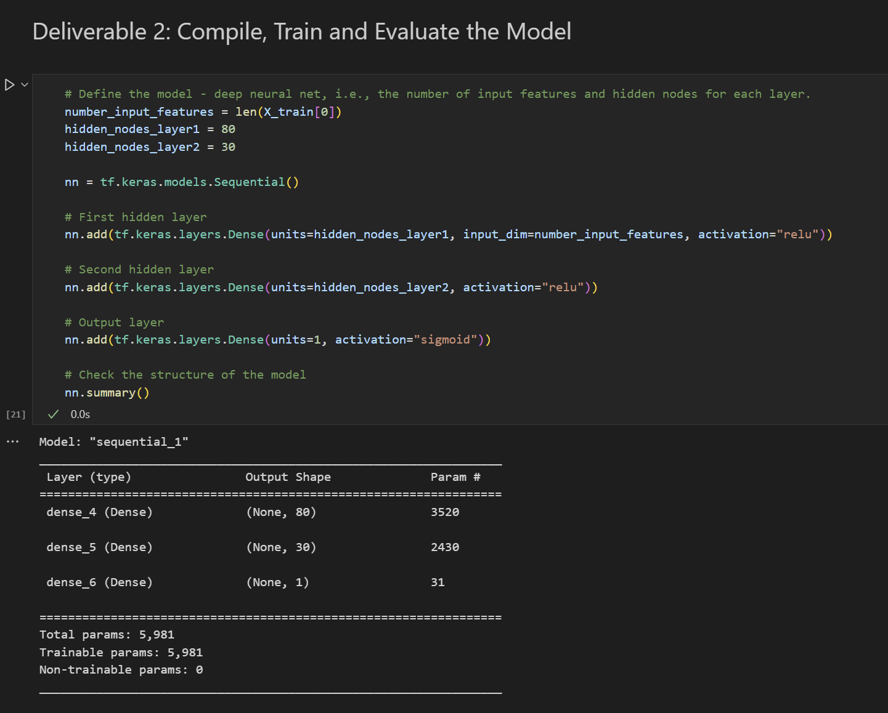
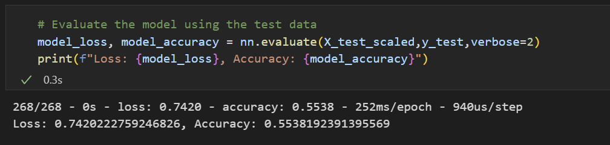
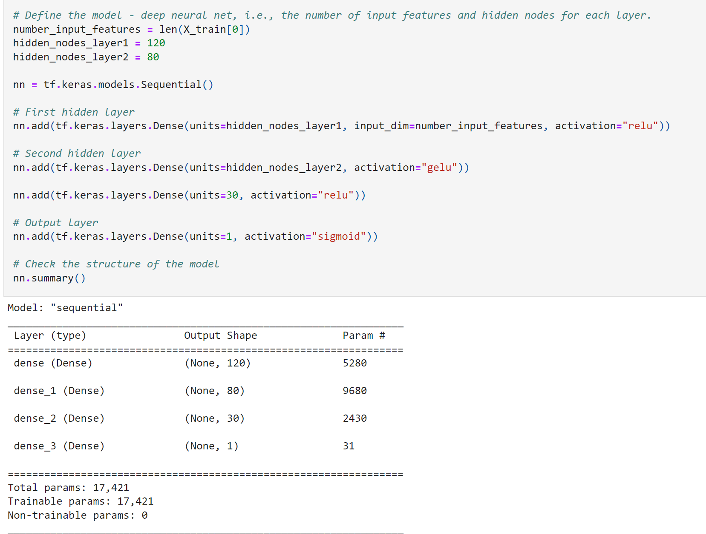
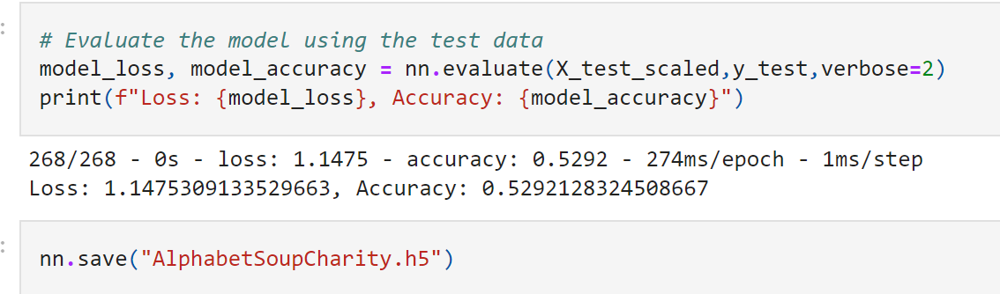

# Neural_Network_Charity_Analysis
## Overview of the analysis 
The purpose of the analysis is to help create a binary classifier to predict whether applicants will be successful if funded by Alphabet Soup. We use Pandas and Scikit-Learn’s StandardScaler to preprocess data for a Neural Network Model, then we use TensorFlow to create a binary classification model, then we compile, train, and evaluate the model. The last piece is to use TensorFlow to optimize the model. 

## Results 

Data Preprocessing
* What variable(s) are considered the target(s) for your model?

    There is one target variable for the model: "IS_SUCCESSFUL". 

    
* What variable(s) are considered to be the features for your model?

    The following variables are considered as the features:
APPLICATION_TYPE, 
AFFILIATION, 
CLASSIFICATION, 
USE_CASE, 
ORGANIZATION, 
STATUS, 
INCOME_AMT,
SPECIAL_CONSIDERATIONS, 
and ASK_AMT. 

    
* What variable(s) are neither targets nor features, and should be removed from the input data?

    The variables of EIN and NAME should be removed.  

Compiling, Training, and Evaluating the Model
* How many neurons, layers, and activation functions did you select for your neural network model, and why? 

    Two hidden layers were selected. The first layer has 80 neurons and the second layer has 30 neurons. I used activation function Relu for the two hidden layers, and activation function Sigmoid for Output. We selected these numbers and settings because we started from simple structure and widely used activation functions. 

    

* Were you able to achieve the target model performance?

    The target model performance was not achieved. The accuracy was 55.38%. 
        
* What steps did you take to try and increase model performance?

    We made three attempts: 1. We added another layer; 2.We increaed the number of neurons for each hidden layer; 3.we changed the activation function. In the end, we obtained the result, which was 52.92%. 

    
    
## Summary

Overall, we tested several different neural network structures and the best performance of the deep learning model was 55.38%. We also added code to save the model's weights every 5 epochs and saved the results to an HDF5 file. Recommendation: The model seems not good enough for this dataset. Learning different models, activaiton functions and data cleaning could increase the accuracy percentage. 